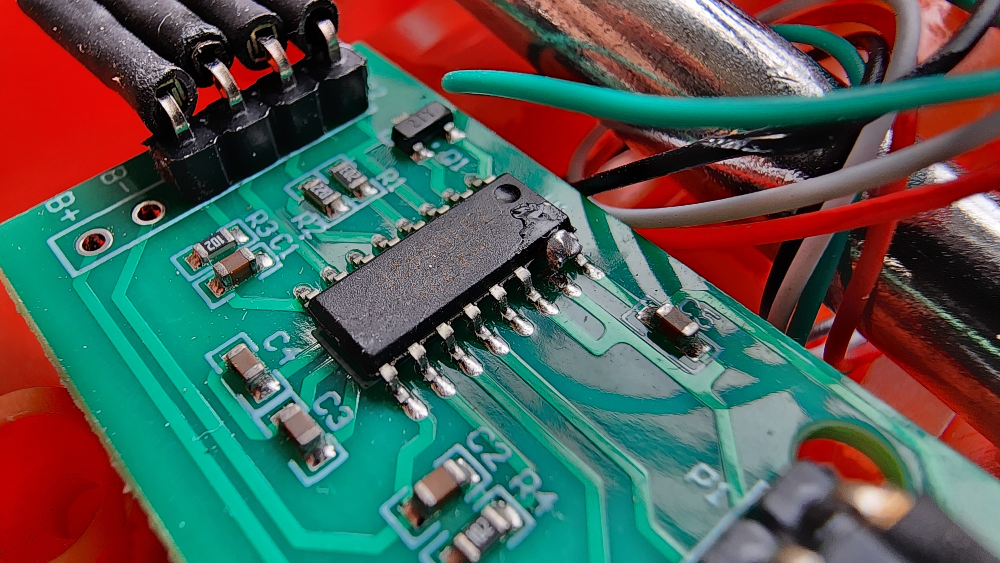
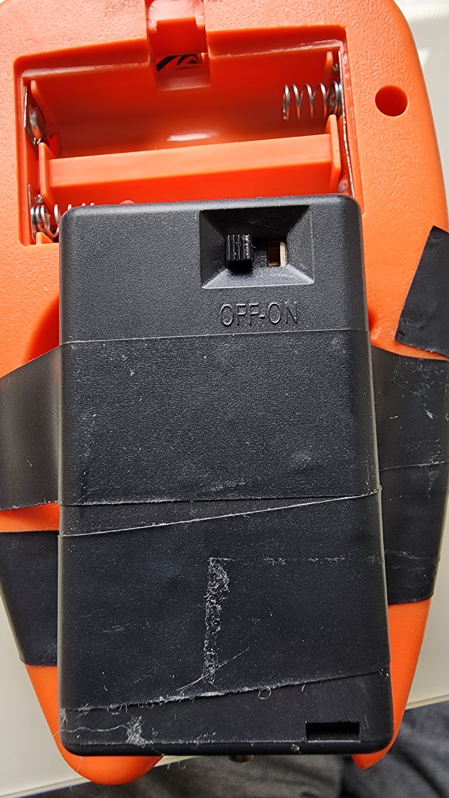
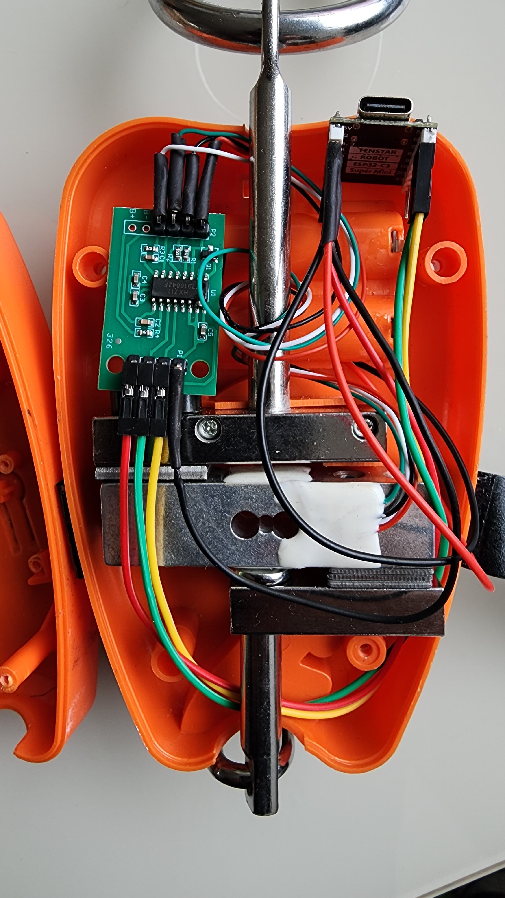
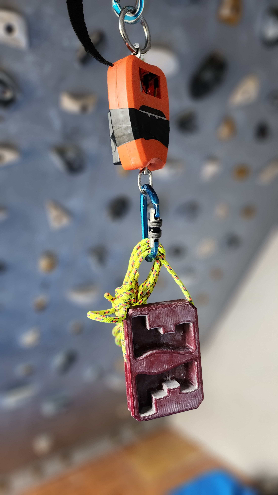

# ucrimp

**ucrimp** is a MicroPython-based project for the ESP32-C3 Super Mini that integrates a load cell and 
HX711 amplifier to measure weight around 80 samples per second. 

This setup is ideal for high-resolution force tracking in embedded and IoT applications, thus allowing 
force measurements tools to be used in climbing/grip strenght training.

---

## Features

* High-speed sampling (\~80Hz) using HX711
* SPI-based HX711 integration for efficiency
* BLE support via `aioble`

---

## Credits

* [HX711 SPI driver](https://github.com/robert-hh/hx711/tree/master)
* [aioble](https://github.com/micropython/micropython-lib/blob/master/micropython/bluetooth/aioble/README.md)
* People that helped e along the way!

---

## Project Structure

```
ucrimp/
└── src/
    ├── main.py              # Entry point, starts weight acquisition
    ├── calibration.py       # Manual or scripted calibration tool
    └── lib/
        ├── calculations.py  # Utility functions (e.g., averaging, filtering)
        ├── devices.py       # Device setup: HX711, BLE, GPIO
        ├── hx711_spi.py     # SPI-based HX711 interface
        └── aioble/          # BLE support (optional)
```

---

## Hardware Components

* **[Load Cell](https://www.mercadolivre.com.br/balanca-digital-suspensa-100kg-200kg-alta-preciso/p/MLB27345293?pdp_filters=item_id%3AMLB5409409212&from=gshop&matt_tool=48995110&matt_internal_campaign_id=&matt_word=&matt_source=google&matt_campaign_id=22603531562&matt_ad_group_id=185825366131&matt_match_type=&matt_network=g&matt_device=c&matt_creative=754595630379&matt_keyword=&matt_ad_position=&matt_ad_type=pla&matt_merchant_id=735125422&matt_product_id=MLB27345293-product&matt_product_partition_id=2423119992713&matt_target_id=aud-1967156880386:pla-2423119992713&cq_src=google_ads&cq_cmp=22603531562&cq_net=g&cq_plt=gp&cq_med=pla&gad_source=1&gad_campaignid=22603531562&gclid=CjwKCAjw9anCBhAWEiwAqBJ-cy2Icaw-p0CzQJOuLoVcqTwQFDGHEJgobebDxcjHw2taVzbDG99TSRoCK3cQAvD_BwE)** (e.g., 5kg strain gauge)
* **[HX711 Amplifier](https://www.mercadolivre.com.br/modulo-hx711-sensor-hx-711-carga-peso-balanca-arduino/p/MLB35506058?pdp_filters=item_id%3AMLB5303898590&from=gshop&matt_tool=49601181&matt_internal_campaign_id=&matt_word=&matt_source=google&matt_campaign_id=22090354496&matt_ad_group_id=173090612396&matt_match_type=&matt_network=g&matt_device=c&matt_creative=727882733433&matt_keyword=&matt_ad_position=&matt_ad_type=pla&matt_merchant_id=735128188&matt_product_id=MLB35506058-product&matt_product_partition_id=2389865441028&matt_target_id=aud-1967156880386:pla-2389865441028&cq_src=google_ads&cq_cmp=22090354496&cq_net=g&cq_plt=gp&cq_med=pla&gad_source=1&gad_campaignid=22090354496&gclid=CjwKCAjw9anCBhAWEiwAqBJ-c_wJKuCjUpCoC5fmaLhpNrOJXdtxKo3Ua0dWlXOjBRFVeqR5YC-U1hoCoekQAvD_BwE)**
* **[ESP32-C3 Super Mini](https://curtocircuito.com.br/placa-super-mini-esp32-c3.html?utm_term=&utm_campaign=&utm_source=adwords&utm_medium=ppc&hsa_acc=7016354091&hsa_cam=22017597287&hsa_grp=175891755750&hsa_ad=725220908819&hsa_src=g&hsa_tgt=pla-387028627337&hsa_kw=&hsa_mt=&hsa_net=adwords&hsa_ver=3&gad_source=1&gad_campaignid=22017597287&gclid=CjwKCAjw9anCBhAWEiwAqBJ-cxDfs-f_OorbJr0qVmeDbDlpxcRIWRUBAUqFXv5W-pycp81IAaMtfhoCfnsQAvD_BwE)**
* **[3 x AAA Battery casing](https://produto.mercadolivre.com.br/MLB-4498825192-suporte-para-3-pilhas-aaa-palito-com-rabicho-kit-5-pecas-_JM?matt_tool=49601181&matt_internal_campaign_id=&matt_word=&matt_source=google&matt_campaign_id=22090354496&matt_ad_group_id=173090612396&matt_match_type=&matt_network=g&matt_device=c&matt_creative=727882733433&matt_keyword=&matt_ad_position=&matt_ad_type=pla&matt_merchant_id=5320477086&matt_product_id=MLB4498825192&matt_product_partition_id=2394343693421&matt_target_id=aud-1967156880386:pla-2394343693421&cq_src=google_ads&cq_cmp=22090354496&cq_net=g&cq_plt=gp&cq_med=pla&gad_source=1&gad_campaignid=22090354496&gclid=CjwKCAjw9anCBhAWEiwAqBJ-c6juK0T7oJlDVjfdn3FYYlNcNvoucd6u9rzUwBtvLb1V5ePj9uzDThoCt4oQAvD_BwE)**
* Breadboard / soldered connections / jumper wires


### Hardware modifications

To make the HX711 work at 80 samples per seconds, it was needed to modify the board disconnecting the RATE pin from the GND and connecting it to the DVDD pin.

For this, the following [tutorial](https://www.youtube.com/watch?v=0cxS-a837bY) is very usefull.
Also for more improvements, there is [this video](https://www.youtube.com/watch?v=Rp_M0NbDSpo), which goes in details of some improvements that can be done.


<div>
    
</div>

---

## Wiring Diagram

**HX711 to ESP32-C3 Super Mini (example using SPI):**

For this the pin 4 should be kept without connections!

| HX711 Pin | ESP32-C3 Pin |
| --------- | ------------ |
| VCC       | 3.3V         |
| GND       | GND          |
| DT (DOUT) | GPIO4        |
| SCK       | GPIO5        |

Ensure that the HX711 module supports 3.3V logic. Use a logic level converter if necessary.

<div>
    
    
</div>

---

## Installation

### 1. Flash MicroPython to ESP32-C3

Follow the [instructions](https://docs.micropython.org/en/latest/esp32/tutorial/intro.html) at MicroPython page.

### 2. Upload Project Files

You can use `mpremote`, `thonny`, or `ampy` to upload files:

```bash
cd src
mpremote mkdir lib
mpremote cp main.py :
mpremote cp calibration.py :
mpremote cp lib/* :lib/
mpremote cp -r lib/aioble :lib/aioble
```
---

## Calibration

This will need to be executed only once.

The callibration script will wait for the user to input the current weight value and will print the 
median of the raw values based on the samples amount.

A good starting point of weights to be used for calibration is:
0% -> No additional load attached to the load cell
25% -> 25% of the maximum load of the load cell
50% -> 50% of the maximum load of the load cell


To end the calibration, interrupt with keyboard.

1. To calibrate the load cell you can either:
    - Run `calibration.py`
    - Via REPL, import the `calibrate` function and call it.
    ```python
    >>> from calibration import calibrate
    >>> calibrate()
    ```
2. Place a known weight on the load cell.
3. Follow the prompts to adjust the scale factor until the correct value is reported.
4. Update the calibration constant in `main.py` or save it persistently if implemented.

---

## Running the Project

After connecting the hardware:

1. Plug in the ESP32-C3 Super Mini and reset it.
2. `main.py` will start the advertisement.
3. As soon as you connect with the uCrimp device via bluetooth, the data will be streamed via notifications.
4. The data will be sent as a little-endian weight (float) and timestamp (uint32)

---

## Final Product Image

For this specific project, I've used the following [scale](https://www.mercadolivre.com.br/balanca-digital-suspensa-100kg-200kg-alta-preciso/p/MLB27345293?pdp_filters=item_id%3AMLB5409409212&from=gshop&matt_tool=48995110&matt_internal_campaign_id=&matt_word=&matt_source=google&matt_campaign_id=22603531562&matt_ad_group_id=185825366131&matt_match_type=&matt_network=g&matt_device=c&matt_creative=754595630379&matt_keyword=&matt_ad_position=&matt_ad_type=pla&matt_merchant_id=735125422&matt_product_id=MLB27345293-product&matt_product_partition_id=2423119992713&matt_target_id=aud-1967156880386:pla-2423119992713&cq_src=google_ads&cq_cmp=22603531562&cq_net=g&cq_plt=gp&cq_med=pla&gad_source=1&gad_campaignid=22603531562&gclid=CjwKCAjw9anCBhAWEiwAqBJ-cy2Icaw-p0CzQJOuLoVcqTwQFDGHEJgobebDxcjHw2taVzbDG99TSRoCK3cQAvD_BwE)

The load cell in this probably isn't the best one around, but it's enough for this project.
Also the casing could be easily host in the ESP32-C3 Super Mini with wires attaching to the [HX711](https://www.mercadolivre.com.br/modulo-hx711-sensor-hx-711-carga-peso-balanca-arduino/p/MLB35506058?pdp_filters=item_id%3AMLB5303898590&from=gshop&matt_tool=49601181&matt_internal_campaign_id=&matt_word=&matt_source=google&matt_campaign_id=22090354496&matt_ad_group_id=173090612396&matt_match_type=&matt_network=g&matt_device=c&matt_creative=727882733433&matt_keyword=&matt_ad_position=&matt_ad_type=pla&matt_merchant_id=735128188&matt_product_id=MLB35506058-product&matt_product_partition_id=2389865441028&matt_target_id=aud-1967156880386:pla-2389865441028&cq_src=google_ads&cq_cmp=22090354496&cq_net=g&cq_plt=gp&cq_med=pla&gad_source=1&gad_campaignid=22090354496&gclid=CjwKCAjw9anCBhAWEiwAqBJ-c_wJKuCjUpCoC5fmaLhpNrOJXdtxKo3Ua0dWlXOjBRFVeqR5YC-U1hoCoekQAvD_BwE) conversor.



---

## License

This project is licensed under the MIT License. See `LICENSE` for details.
